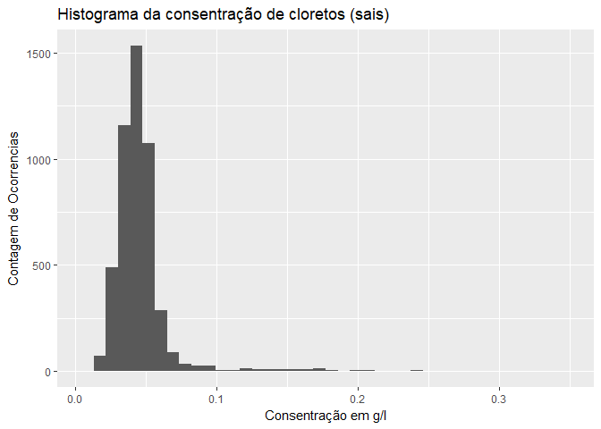
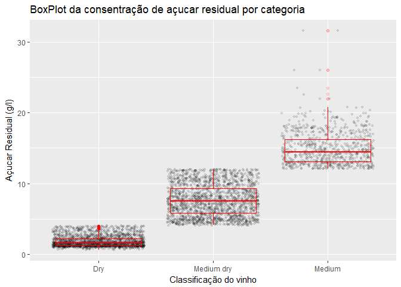
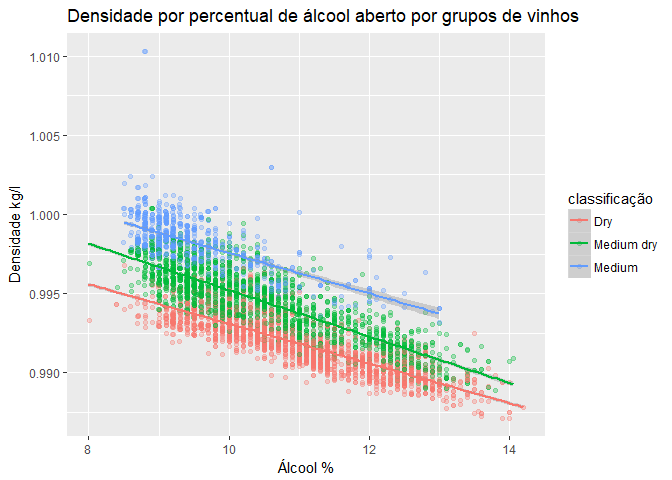

Análise Exploratória Sobre Vinhos Brancos
================

Introdução
==========

Os dados analisados são provenientes do trabalho *Modeling wine preferences by data mining from physicochemical properties*, onde se encontra informações sobre as composições químicas e propriedades físicas da uma amostra de 4898 vinhos. Para cada vinho também é acompanhado uma avaliação sensorial com uma nota de 0 a 10.

Análise Univariada
==================

### Estrutura dos dados

``` r
str(df)
```

    ## Classes 'data.table' and 'data.frame':   4898 obs. of  12 variables:
    ##  $ fixed.acidity       : num  7 6.3 8.1 7.2 7.2 8.1 6.2 7 6.3 8.1 ...
    ##  $ volatile.acidity    : num  0.27 0.3 0.28 0.23 0.23 0.28 0.32 0.27 0.3 0.22 ...
    ##  $ citric.acid         : num  0.36 0.34 0.4 0.32 0.32 0.4 0.16 0.36 0.34 0.43 ...
    ##  $ residual.sugar      : num  20.7 1.6 6.9 8.5 8.5 6.9 7 20.7 1.6 1.5 ...
    ##  $ chlorides           : num  0.045 0.049 0.05 0.058 0.058 0.05 0.045 0.045 0.049 0.044 ...
    ##  $ free.sulfur.dioxide : num  45 14 30 47 47 30 30 45 14 28 ...
    ##  $ total.sulfur.dioxide: num  170 132 97 186 186 97 136 170 132 129 ...
    ##  $ density             : num  1.001 0.994 0.995 0.996 0.996 ...
    ##  $ pH                  : num  3 3.3 3.26 3.19 3.19 3.26 3.18 3 3.3 3.22 ...
    ##  $ sulphates           : num  0.45 0.49 0.44 0.4 0.4 0.44 0.47 0.45 0.49 0.45 ...
    ##  $ alcohol             : num  8.8 9.5 10.1 9.9 9.9 10.1 9.6 8.8 9.5 11 ...
    ##  $ quality             : int  6 6 6 6 6 6 6 6 6 6 ...
    ##  - attr(*, ".internal.selfref")=<externalptr>

``` r
summary(df)
```

    ##  fixed.acidity    volatile.acidity  citric.acid     residual.sugar  
    ##  Min.   : 3.800   Min.   :0.0800   Min.   :0.0000   Min.   : 0.600  
    ##  1st Qu.: 6.300   1st Qu.:0.2100   1st Qu.:0.2700   1st Qu.: 1.700  
    ##  Median : 6.800   Median :0.2600   Median :0.3200   Median : 5.200  
    ##  Mean   : 6.855   Mean   :0.2782   Mean   :0.3342   Mean   : 6.391  
    ##  3rd Qu.: 7.300   3rd Qu.:0.3200   3rd Qu.:0.3900   3rd Qu.: 9.900  
    ##  Max.   :14.200   Max.   :1.1000   Max.   :1.6600   Max.   :65.800  
    ##    chlorides       free.sulfur.dioxide total.sulfur.dioxide
    ##  Min.   :0.00900   Min.   :  2.00      Min.   :  9.0       
    ##  1st Qu.:0.03600   1st Qu.: 23.00      1st Qu.:108.0       
    ##  Median :0.04300   Median : 34.00      Median :134.0       
    ##  Mean   :0.04577   Mean   : 35.31      Mean   :138.4       
    ##  3rd Qu.:0.05000   3rd Qu.: 46.00      3rd Qu.:167.0       
    ##  Max.   :0.34600   Max.   :289.00      Max.   :440.0       
    ##     density             pH          sulphates         alcohol     
    ##  Min.   :0.9871   Min.   :2.720   Min.   :0.2200   Min.   : 8.00  
    ##  1st Qu.:0.9917   1st Qu.:3.090   1st Qu.:0.4100   1st Qu.: 9.50  
    ##  Median :0.9937   Median :3.180   Median :0.4700   Median :10.40  
    ##  Mean   :0.9940   Mean   :3.188   Mean   :0.4898   Mean   :10.51  
    ##  3rd Qu.:0.9961   3rd Qu.:3.280   3rd Qu.:0.5500   3rd Qu.:11.40  
    ##  Max.   :1.0390   Max.   :3.820   Max.   :1.0800   Max.   :14.20  
    ##     quality     
    ##  Min.   :3.000  
    ##  1st Qu.:5.000  
    ##  Median :6.000  
    ##  Mean   :5.878  
    ##  3rd Qu.:6.000  
    ##  Max.   :9.000

``` r
df_scale <- as.data.frame(lapply(df, scale))
ggplot(stack(df_scale), aes(x = ind, y = values)) + 
    geom_violin() +
    labs(title ="Distribuição das Variáveis de Forma Normalizada", 
         x = "Variáveis", 
         y = "Valor Normalizado") +
    theme(axis.text.x = element_text(angle = 45, hjust = 1))
```


Pelo gráfico da distribuição das variáveis na mesma escaladas podemos observar alguns casos com comportamento que re-assemelham a distribuição normal, como o ácidos fixos do vinho `fixed.acidity`, o pH e os sulfatos `sulphates`. Outra observação que podemos notar é a ocorrência de valores extremos principalmente na densidade `density` e no dióxido de enxofre livre `free.sulfur.dioxide` que precisam ser avaliados individualmente.

A informação mais importante que temos é a avaliação sensorial da qualidade do vinho `quality`, qual é dependente de uma avaliação sensorial para sua atribuição e possui maior margem para um bias do avaliador.

``` r
ggplot(df, aes(x = quality))  +
    geom_histogram(bins = 7) +
    labs(title ="Histograma das notas obtidas dos vinhos", 
         x = "Notas Obtidas na Qualidade (quality)", 
         y = "Contagem de Ocorrencias")
```


``` r
ggplot(df, aes(quality)) + 
    stat_ecdf() + 
    geom_vline(xintercept = quantile(df$quality, 0.05),
               col = "red", linetype = "dashed") +
    geom_vline(xintercept = quantile(df$quality, 0.95),
               col = "red", linetype = "dashed") +
    labs(title ="ECDF notas obtidas dos vinhos \ncom limites do intervalo de 90% dos dados", 
         x = "Notas Obtidas na Qualidade (quality)", 
         y = "Frequancia")
```


Grande parte das notas se concentram principalmente entre as notas de 5 a 7 (contendo mais de 90% dos casos) mesmo sendo a nota em uma escala de 0 a 10. Podemos ainda perceber a ausência de vinhos com notas de 1, 2 e 10.

### Avaliação das propriedades fisicas e quimícas

``` r
ggplot(df, aes(x = pH))  +
    geom_histogram(bins = 40) +
    geom_vline(xintercept = 3, col = "red", linetype = "dashed") +
    labs(title ="Histograma do pH encontrado nos vinhos", 
         x = "pH", 
         y = "Contagem de Ocorrencias")
```


O pH encontrado possui valores dentro da variabilidade normal dos vinhos (entre 3 e 4), sendo poucos casos com valores abaixo de 3 com uma acidez mais elevada.

``` r
ggplot(df, aes(x = pH))  +
    geom_density(fill = "gray") +
    labs(title ="Frequencia do pH encontrado nos vinhos versus curva normal", 
         x = "pH", 
         y = "Frequencia") +
    stat_function(fun = dnorm, args = list(mean = mean(df$pH), sd = sd(df$pH)), col = "red")
```


Podemos ter observar a semelhança ao comparar contra a curva normal teórica com os valores amostrais da média e desvio padrão. Assim podemos testar a hipótese: H0 = O pH dos vinhos possuem uma distribuição normal H1 = O pH dos vinhos não possuem uma distribuição normal

``` r
ks.test(df[, pH], "pnorm", alternative = "t")
```

    ## 
    ##  One-sample Kolmogorov-Smirnov test
    ## 
    ## data:  df[, pH]
    ## D = 0.99679, p-value < 2.2e-16
    ## alternative hypothesis: two-sided

Com o resultado do teste tendo o valor de p-value &lt; 0.025 (0.05/2), não podemos excluir a hipótese H0, assim podemos assumir que o pH dos vinhos possuem uma distribuição normal com um grau de confiança de 95%.

``` r
ggplot(df, aes(x = alcohol))  +
    geom_histogram(bins = 15) +
    labs(title ="Histograma da consentração de álcool", 
         x = "Consentração de álcool em %", 
         y = "Contagem de Ocorrencias")
```


``` r
ggplot(df, aes(x = chlorides))  +
    geom_histogram(bins = 40) +
    labs(title ="Histograma da consentração de cloretos (sais)", 
         x = "Consentração em g/l", 
         y = "Contagem de Ocorrencias")
```


A concentração de sais possui uma concentração muito grande de ocorrências no intervalo de 0 a 0.1, assim para poder observar melhor a distribuição da cauda, plotamos novamente com a escala da contagem modificada pelo log.

``` r
ggplot(df, aes(x = chlorides))  +
    geom_histogram(bins = 40) +
    coord_trans(x = 'log10') +
    labs(title ="Histograma da consentração de cloretos (sais)", 
         x = "Consentração (g/l) log", 
         y = "Contagem de Ocorrencias")
```



Com a escala ajustada para log podemos ter uma observação muito melhor de uma distribuição se assemelhando a uma distribuição normal.

``` r
ggplot(df, aes(x = residual.sugar))  +
    geom_histogram(bins = 100) +
    labs(title ="Histograma da consentração de açucar residual", 
         x = "Açucar Residual (g/l)", 
         y = "Contagem de Ocorrencias")
```


Na concentração de açucares, como nas concentrações de sais, uma concentração dos valores, principalmente abaixo de 10g/l, porém deviso a escala não conseguimos observar quantos vinhos possuem extremos.

``` r
ggplot(df, aes(x = residual.sugar))  +
    geom_histogram(bins = 50) +
    scale_x_log10() +
    labs(title ="Histograma da consentração de açucar residual", 
         x = "Açucar Residual (g/l) log", 
         y = "Contagem de Ocorrencias")
```


Novamente alterando a escala da contagem para log, podemos observar a ocorrência de um vinho com uma quantidade extremamente alta em contraste aos demais. A distribuição também apresenta aspecto bi-modal que pode ser investigado uma relação com outras variáveis.

Observando uma a referencia do [Wikipédia](https://en.wikipedia.org/wiki/Sweetness_of_wine) podemos observar que essa ocorrência que observamos é a unica onde possui a classificação de vinho doce (&gt;40g/l).

``` r
# atualização do dataframe para remover o vinho com classificação Doce
df <- df[residual.sugar < 45]

# criação dos ranges de separação
sweetness_ranges <- unique(c(-Inf, 4, 12, Inf))
sweetness_labels <- c("Dry", "Medium dry", "Medium")
sweetness_class <- cut(df$residual.sugar, breaks = sweetness_ranges,
                       labels = sweetness_labels)
# adicionar as classificações ao dataframe
df <- cbind(df, sweetness_class)
```

Criamos o agrupamento dos tipos de vinho referente a quantidade de açúcar residual. Agora podemos observar as ocorrências e um boxplot dos valores dentro do grupo para entender a dispersão e estatísticas dos mesmos.

``` r
ggplot(df, aes(x = sweetness_class, y = residual.sugar)) +
    geom_jitter(alpha = 0.1, size = 0.9) +
    geom_boxplot(alpha = 0.1, col = "red") +
    labs(title ="BoxPlot da consentração de açucar residual por categoria", 
         x = "Classificação do vinho", 
         y = "Açucar Residual (g/l)")
```



``` r
df %>% 
    group_by(sweetness_class) %>% 
    summarise(
        q1 = quantile(residual.sugar, 0.25),
        median = median(residual.sugar),
        q3 = quantile(residual.sugar, 0.75),
        iqr = IQR(residual.sugar),
        sd = sd(residual.sugar),
        n = n()
    )
```

    ## # A tibble: 3 x 7
    ##   sweetness_class    q1 median    q3   iqr        sd     n
    ##            <fctr> <dbl>  <dbl> <dbl> <dbl>     <dbl> <int>
    ## 1             Dry   1.3   1.60   2.2   0.9 0.7646694  2097
    ## 2      Medium dry   5.8   7.50   9.3   3.5 2.2017479  1975
    ## 3          Medium  13.1  14.45  16.2   3.1 2.3364852   825

Para entender melhor os grupos criados, podemos criar um gráfico de densidade, o qual pode mostrar mais detalhes de como são as distribuições das concentrações pelos grupos.

``` r
ggplot(df, aes(x = residual.sugar, color = as.factor(sweetness_class))) +
    geom_density(alpha = 0.1, size = 1) +
    labs(title ="Gráfico de densidade da consentração de açucar residual por categoria", 
         x = "Açucar Residual (g/l)", 
         y = "% de Ocorrência",
         color = 'Classificação do vinho')
```


Podemos observar que os vinhos secos possuem uma dispersão muito menor em relação aos demais mesmo com um espaço amostral maior.

Análise Bivariada
=================

Iniciamos a análise bivariada com um gráfico para mostrar todas as correlações, assim direcionando a análise posteriormente para os de maior interesse visto a grande possibilidade de combinações de variáveis.

``` r
chart.Correlation(select(df, -sweetness_class))
```


Visto que a nossa variável de maior interesse é a qualidade do vinho, vamos inicialmente observar por meio de um boxplot contra a concentração de álcool, a qual mostrou a maior correlação com a qualidade.

``` r
ggplot(df, aes(y = alcohol, x = as.factor(quality), fill = as.factor(quality))) + 
    geom_boxplot() +
    labs(title ="Boxplot da Distribuição da consentração de alcool por qualidade", 
         x = "Qualidade", 
         y = "Consentração de alcool (%)") +
    theme(legend.position="none")
```


Dentre todas as classificações de qualidade é possível observar que a dispersão dos dados se mantem relativamente constante, exceto nas notas 9 onde se observa um variação menor.

Durante a análise análise univariada foi encontrado uma característica bi-modal para as concentrações de açúcar residual. Esse comportamento pode estar associado a uma outra característica do vinho. Podemos avaliar se ao abrir a concentração de açúcar pela qualidade conseguimos realizar alguma associação.

``` r
ggplot(df, aes(x = residual.sugar, color = as.factor(quality)))  +
    geom_density() +
    scale_x_log10() +
    scale_colour_brewer(palette = 'Spectral') +
    labs(title ="Frequencia do açucar residual por qualidade", 
         x = "Açucar Residual (g/l) log", 
         y = "Frequência",
         color = "Qualidade")
```


A bimodalidade do açúcar residual é mais intensa no vinhos com notas menores, conforme o incremento da qualidade, a distribuição se se acentua para concentrações menores de açúcar residual.

O açúcar residual por sua vez é o que em conjunto com a densidade apresentou a maior correlação de todas as combinações. Para observar melhor essa relação temos que aplicar uma transparência aos pontos do gráfico para remover o efeito de over-plotting.

``` r
ggplot(df, aes(x = residual.sugar, y = density)) + 
    geom_jitter(alpha = 0.1) +
    geom_smooth(method = 'lm') +
    labs(title ="Densidade pelo açucar residual", 
         x = "Açucar Residual (g/l)", 
         y = "Densidade")
```


``` r
summary(lm(density ~ residual.sugar, data=df))
```

    ## 
    ## Call:
    ## lm(formula = density ~ residual.sugar, data = df)
    ## 
    ## Residuals:
    ##        Min         1Q     Median         3Q        Max 
    ## -0.0055605 -0.0011104  0.0001933  0.0011568  0.0060178 
    ## 
    ## Coefficients:
    ##                 Estimate Std. Error t value Pr(>|t|)    
    ## (Intercept)    9.909e-01  3.735e-05 26534.1   <2e-16 ***
    ## residual.sugar 4.872e-04  4.607e-06   105.7   <2e-16 ***
    ## ---
    ## Signif. codes:  0 '***' 0.001 '**' 0.01 '*' 0.05 '.' 0.1 ' ' 1
    ## 
    ## Residual standard error: 0.001612 on 4895 degrees of freedom
    ## Multiple R-squared:  0.6955, Adjusted R-squared:  0.6954 
    ## F-statistic: 1.118e+04 on 1 and 4895 DF,  p-value: < 2.2e-16

Um modelo linear apresenta um fit satisfatório. No gráfico é interessante notar que na parte superior do modelo linear aparenta ocorrer uma concentração maior de ocorrências para os valores intermediários de açúcar residual.

Análise Multivariada
====================

Continuando a avaliação anterior, encontramos um comportamento interessante entre a densidade e o açúcar residual, porém temos que direcionar as análises para a variável de interesse desse conjunto de dados que é a qualidade.

Sobre o mesmo gráfico anterior, podemos incluir a qualidade na dimensão das cores, assim buscando algum comportamento que ajude a futuramente criar um modelo de previsão.

``` r
# criado uma palleta de cores para melhorar a percepção dos valores em escalas
# contínuas
colors_spectral <- rev(brewer.pal(11, 'Spectral'))

ggplot(df, aes(x = residual.sugar, y = density, color = quality)) + 
    geom_jitter(alpha = 0.3, size = 1.5) +
    scale_colour_gradientn(colours = colors_spectral) +
    geom_smooth(method = 'lm', formula = y ~ x, se = FALSE, linetype = 'dashed') +
    labs(title ="Densidade pelo açucar residual atribuído por qualidade", 
         x = "Açucar Residual log (g/l)", 
         y = "Densidade",
         color = "Qualidade")
```


podemos ver uma distinção onde os vinhos com maior qualidade ocorrendo em maior frequência sob a linha de regressão do açúcar residual com a densidade.

Para tentar obter outros insights dessa tríade de variáveis, vamos inverter as coordenadas para conseguir capturar esse comportamento de forma mais clara.

``` r
ggplot(df, aes(x = quality, y = residual.sugar, color = density)) + 
    geom_jitter(alpha = 0.8) +
    scale_colour_gradientn(colours = colors_spectral) +
    labs(title ="Açucar residual pela qualidade por densidade", 
         x = "Qualidade", 
         y = "Açucar Residual log (g/l)",
         color = "Densidade")
```


``` r
ggplot(df, aes(x = quality, y = chlorides, color = alcohol)) + 
    geom_jitter(alpha = 0.8) +
    scale_colour_gradientn(colours = colors_spectral) +
    labs(title ="Cloretos pela qualidade por álcool", 
         x = "Qualidade", 
         y = "Cloretos (g/l)",
         color = "Álcool %")
```


As maiores notas estão relacionadas a maiores níveis de álcool e menores teores de cloretos, assim direcionando para quais variáveis utilizar em modelos de determinação da qualidade.

### Modelo de determinação da qualidade dos vinhos

``` r
cv_fit_lasso <- cv.glmnet(as.matrix(select(df, -quality, -sweetness_class)),
                          as.matrix(select(df, quality)))
cv_fit_coef <- coef(cv_fit_lasso, s = "lambda.1se")

cv_fit_coef_df <- as.data.frame(as.matrix(cv_fit_coef)) %>%
    rename(lasso = '1') %>%
    rownames_to_column(var = 'variable')

ggplot(filter(cv_fit_coef_df, variable != '(Intercept)'), 
       aes(x = variable, y = lasso)) +
    geom_point() +
    theme(axis.text.x = element_text(angle = 45, hjust = 1)) +
    labs(title ="Regressão Lasso", 
         x = "Variáveis", 
         y = "Lasso")
```


Incluímos uma análise de regressão por Lasso para ajudar a identificar variáveis que podem agregar mais no momento de determinar um modelo para os dados. Podemos ver um destaque para a densidade, algo que foi observado anteriormente em conjunto com o açúcar residual.

Para o modelo iremos utilizar as variáveis que encontramos os maiores relacionamentos com qualidade dos vinhos. As mesmas sendo acrecidas uma a uma no modelo para observar a mudança do comportamento do modelo.

-   alcohol
-   density
-   residual.sugar
-   chlorides

``` r
# criação dos modelos lineares
m1 <- lm(quality ~ alcohol, data = df)
m2 <- update(m1, ~ . + density)
m3 <- update(m2, ~ . + residual.sugar)
m4 <- update(m3, ~ . + chlorides)

# captura o valor de r^2 para os modelos
models <- list(m1, m2, m3, m4)
map(models, summary) %>% 
    map_df(`[`, c('r.squared'))
```

    ## # A tibble: 4 x 1
    ##   r.squared
    ##       <dbl>
    ## 1 0.1897384
    ## 2 0.1930527
    ## 3 0.2102860
    ## 4 0.2119478

``` r
# avaliação de anova nos modelos para comparar o impacto do incremento de cada
# variável ao modelo
anova(m1, m2, m3, m4, test='Chisq')
```

    ## Analysis of Variance Table
    ## 
    ## Model 1: quality ~ alcohol
    ## Model 2: quality ~ alcohol + density
    ## Model 3: quality ~ alcohol + density + residual.sugar
    ## Model 4: quality ~ alcohol + density + residual.sugar + chlorides
    ##   Res.Df    RSS Df Sum of Sq  Pr(>Chi)    
    ## 1   4895 3112.2                           
    ## 2   4894 3099.5  1    12.730 5.737e-06 ***
    ## 3   4893 3033.3  1    66.193 < 2.2e-16 ***
    ## 4   4892 3026.9  1     6.383  0.001319 ** 
    ## ---
    ## Signif. codes:  0 '***' 0.001 '**' 0.01 '*' 0.05 '.' 0.1 ' ' 1

Infelizmente em nenhum dos modelos aplicados não foi possível obter um resultado de r^2 interessante para aplicar em futuras observações para prever a qualidade dos vinhos. Isso nos mostra que a complexidade do sabor do vinho pode estar também vinculado a outros fatores, como o processo de produção, do que simplesmente a essas propriedades observadas.

Pela análise ANOVA podemos observar que ao acrescentar a densidade e o açúcar residual existe uma melhora significativa do modelo. Já ao acrescentar o cloretos ao modelo houve uma melhora, porém não no mesma intensidade das demais.

Gráficos Finais
===============

Nos últimos gráficos vamos explorar mais como as características se distinguem dentro dos grupos de vinhos `Dry`, `Medium dry` e `Medium`. Assim entendendo o relacionamento de algumas variáveis, principalmente as que possuem grande correlações ou que estão dentro do mesmo âmbito de propriedade química.

``` r
ggplot(df, aes(x = alcohol, y = density, col = sweetness_class)) +
    geom_jitter(alpha = 0.3) +
    stat_smooth(method = 'lm') +
    labs(title ="Densidade por percentual de álcool aberto por grupos de vinhos", 
         x = "Álcool %", 
         y = "Densidade kg/l",
         color = "classificação")
```



Primeiramente observamos a relação da quantidade de álcool e a densidade, a qual possui uma alta correlação de -0.80. Essas duas propriedades instintivamente já nos indicariam alguma correlação visto que o álcool com densidade baixa (0,789 0,789 g/cm^3) assim quanto maior sua participação reduzindo a densidade do vinho.

O interessante observar como as relações entre álcool e densidade se segregam dentro dos grupos de vinho, formando cada grupo acima do outro tendo sempre inclinações próximas.

Assim podemos calcular o valor de r^2 para se a *fit* dos grupos também apresentam um comportamento semelhante

``` r
# para executar o r^2 por grupo, utilizamos o dplyr para criar sub-dataframes
# realizar o calculo e depois capturar o r^2 por grupo
df %>%
    nest(-sweetness_class) %>% 
    mutate(fit = map(data, ~ lm(density ~ alcohol, data =.)),
           summary = map(fit, glance)) %>% 
    select(sweetness_class, summary) %>% 
    unnest() %>% 
    select(sweetness_class, r.squared)
```

    ##   sweetness_class r.squared
    ## 1          Medium 0.4360426
    ## 2             Dry 0.7089070
    ## 3      Medium dry 0.7136833

Ao

``` r
ggplot(df, aes(x = free.sulfur.dioxide, y = total.sulfur.dioxide, 
               col = sweetness_class)) +
    scale_x_log10() +
    geom_jitter() +
    stat_smooth(method = 'lm') +
    labs(title ="Dióxido de enxofre total por livre aberto por grupos de vinhos", 
         x = "Dióxido de enxofre total (mg / dm^3) log", 
         y = "Dióxido de enxofre livre (mg / dm^3)",
         color = "classificação")
```


Para a relação entre o total de dióxido de enxofre e a quantidade livre, não é possível observar uma boa distinção dos grupos, porem pelas regressões lineares, podemos observar um alinhamento maior entre os grupos `Meidum` e `Medium dry`.

``` r
ggplot(df, aes(x = volatile.acidity, y = fixed.acidity, col = sweetness_class)) +
    geom_jitter(alpha = 0.6) +
    stat_smooth(method = 'lm') +
    labs(title ="Acidez fixa por volátil aberto por grupos de vinhos", 
         x = "Acidez fixa (tartaric acid - g / dm^3)", 
         y = "Acidez volátil (acetic acid - g / dm^3)",
         color = "classificação")
```


A acidez volátil e fixa acabam não possuindo nenhuma distinção entre os grupos de vinhos. Podemos ver alguma dispersão nas regressões, porém os dados são muito dispersos para poder realizar alguma conclusão.

Reflexão
========

Foi possível encontrar relacionamentos interessantes entre as características físicas e químicas nesse conjunto de dados. A parte da análise multivariada foi as que foi possível encontrar os relacionamentos mais interessantes e os que contribuem mais para uma melhor implementação de um modelo para determinação da qualidade dos vinhos.

Ao final o mais interessante foi poder explorar os dados e encontrar todas essas informações anteriormente ocultas nos dados.

Referências
-----------

P. Cortez, A. Cerdeira, F. Almeida, T. Matos and J. Reis. Modeling wine preferences by data mining from physicochemical properties. In Decision Support Systems, Elsevier, 47(4):547-553. ISSN: 0167-9236.

Disponível: [Elsevier](http://dx.doi.org/10.1016/j.dss.2009.05.016) [Pre-press pdf](http://www3.dsi.uminho.pt/pcortez/winequality09.pdf) [bib](http://www3.dsi.uminho.pt/pcortez/dss09.bib)
